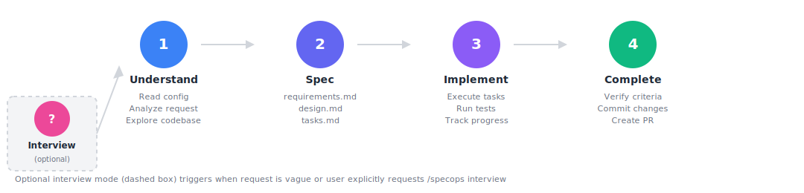
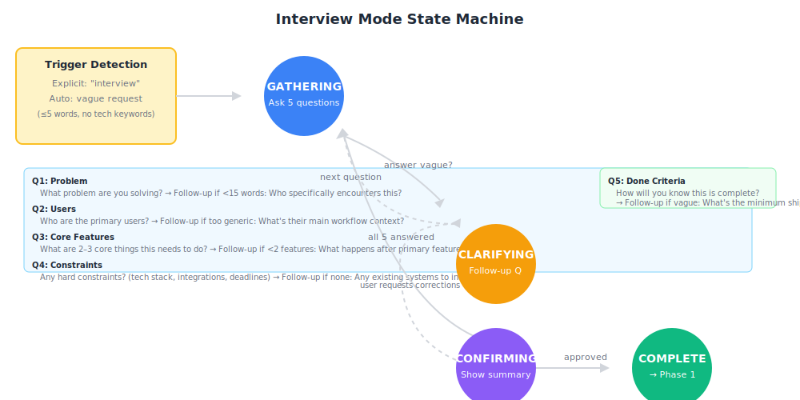
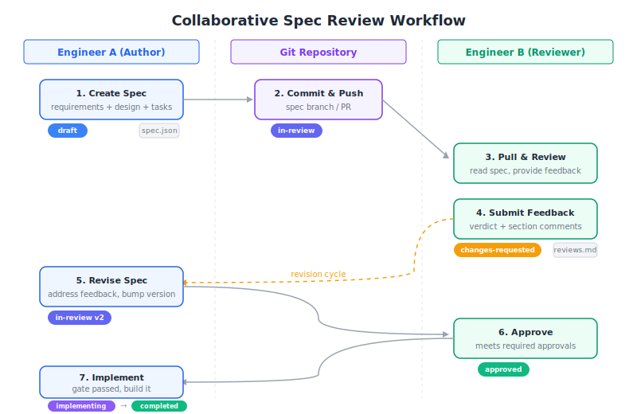
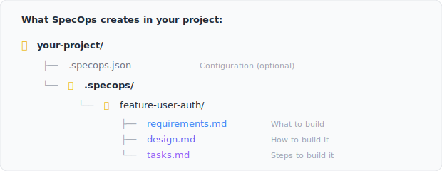
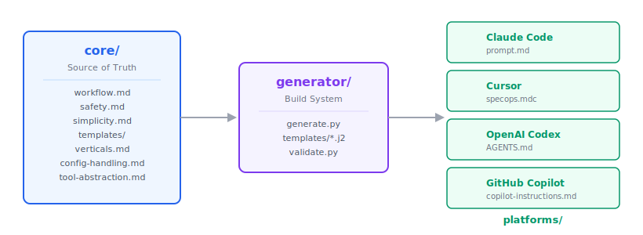

# SpecOps

**Spec-driven development that adapts to your stack, your team, and your workflow.**

[](https://github.com/sanmak/specops/actions/workflows/ci.yml)
[](https://github.com/sanmak/specops/actions/workflows/codeql.yml)
[](https://github.com/sanmak/specops/network/updates)
[](https://github.com/sanmak/specops/releases)
[](https://github.com/sanmak/specops)
[](https://github.com/sanmak/specops/blob/main/LICENSE)

SpecOps brings structured spec-driven development to your AI coding assistant — with domain-specific templates for infrastructure, data pipelines, and SDKs, and a built-in team review workflow for shared codebases. Works with **Claude Code**, **Cursor**, **OpenAI Codex**, and **GitHub Copilot**.

## Why SpecOps

- **Domain-specific templates** — Infrastructure specs include Rollback Steps and Resource Definitions. Data pipeline specs include Data Contracts and Backfill Strategy. Library specs flag Breaking Changes per task. Backend and fullstack use clean defaults — no unnecessary ceremony.
- **Built-in team review cycle** — Draft a spec, get section-by-section feedback from teammates, revise, and only implement once `minApprovals` is met. Git identity detection, configurable approval thresholds, and an implementation gate that blocks unapproved specs from proceeding. Solo developers can enable `allowSelfApproval` for a self-review workflow with distinct audit trail.
- **Security-hardened spec processing** — Convention strings and custom templates are sanitized against prompt injection. Secrets use placeholders, PII uses synthetic data, all config fields enforce strict schema validation, and path traversal is rejected at the boundary.

## Quick Start

**Install (Claude Code):**

```
/plugin marketplace add sanmak/specops
/plugin install specops@specops-marketplace
/reload-plugins
```

**Other platforms & manual install:** [QUICKSTART.md](QUICKSTART.md)

**Use:**

**Claude Code:** `/specops Add user authentication with OAuth` | `View the spec` | `List all specs`
**Cursor / Codex / Copilot:** `Use specops to add user authentication with OAuth` | `View the spec` | `List all specs`

> Full command reference: [docs/COMMANDS.md](docs/COMMANDS.md) | Troubleshooting: [QUICKSTART.md#troubleshooting](QUICKSTART.md#troubleshooting)


## How It Works

<p align="center">
  
</p>

One command triggers a 4-phase workflow: understand your codebase, generate a structured spec, implement it, and verify the result. For vague or high-level ideas, an optional interview mode gathers structured requirements before spec generation. See [Sequence Diagrams](docs/DIAGRAMS.md) for detailed actor interaction views of each workflow.

### Interview Mode (Optional)

For vague or exploratory ideas, SpecOps guides you through a structured interview before generating specs. Trigger explicitly with `/specops interview I want to build X` or say something vague and it auto-triggers. Once approved, SpecOps proceeds to spec generation with enriched context.

<p align="center">
  
</p>

### Team Review Workflow

<p align="center">
  
</p>

For teams, SpecOps adds a structured review cycle between spec creation and implementation. Engineers review specs collaboratively, provide section-by-section feedback, and approve before coding begins. See [TEAM_GUIDE.md](docs/TEAM_GUIDE.md) for the full team workflow.

## What Gets Created

<p align="center">
  
</p>

## Platforms

| Platform           | Status    | Trigger                                                                       |
| ------------------ | --------- | ----------------------------------------------------------------------------- |
| **Claude Code**    | Supported | `/specops [description]`, `/specops view`, `/specops list`                    |
| **Cursor**         | Supported | `Use specops to [description]`, `View the ... spec`, `List all specops specs` |
| **OpenAI Codex**   | Supported | `Use specops to [description]`, `View the ... spec`, `List all specops specs` |
| **GitHub Copilot** | Supported | `Use specops to [description]`, `View the ... spec`, `List all specops specs` |
| Windsurf           | Planned   | —                                                                             |
| Continue.dev       | Planned   | —                                                                             |

## How SpecOps Compares

SpecOps brings multi-platform support, domain-specific templates, team review workflows, and persistent project memory to spec-driven development. Built with 6 features dogfooded using SpecOps itself — every spec is [public in `.specops/`](.specops/).

| Capability | SpecOps | Kiro (Amazon) | GitHub Spec Kit |
|---|---|---|---|
| **Platform support** | 4 platforms | Single IDE | 18+ agents |
| **EARS notation** | Yes | Yes | No |
| **Steering files** | Yes (3 modes) | Yes (4 modes) | No |
| **Local memory** | Yes (git-tracked) | No | No |
| **Drift detection** | Yes (5 checks) | No | No |
| **Vertical templates** | 7 project types | None | Generic |
| **Team review** | Built-in | No | No |
| **Agent hooks** | No | Yes | No |
| **Security hardening** | Yes | No | No |
| **Open source** | MIT | Proprietary | MIT |

[Full comparison with Kiro, EPIC/Reload, and Spec Kit →](docs/COMPARISON.md)

### Plan Mode vs Spec Mode

Most AI coding assistants include a **plan mode** for session-scoped planning. SpecOps adds persistent, reviewable specifications that survive across sessions and team members. Plan mode is a whiteboard sketch; spec mode is the architectural blueprint. Use plan mode for tactical "how" decisions during implementation — use SpecOps when the work spans sessions, involves teammates, or touches code where regressions matter.

[See the full comparison →](docs/PLAN-VS-SPEC.md)

## Configuration

Create `.specops.json` in your project root. Configuration is optional — SpecOps uses sensible defaults.

```json
{
  "specsDir": ".specops",
  "team": {
    "conventions": ["Use TypeScript", "Write tests for business logic"],
    "reviewRequired": true,
    "specReview": { "enabled": true, "minApprovals": 2 }
  },
  "implementation": {
    "autoCommit": false,
    "createPR": true,
    "testing": "auto",
    "taskDelegation": "auto"
  }
}
```

See [examples/](examples/) for minimal, standard, and full configurations. Full schema reference in [REFERENCE.md](docs/REFERENCE.md).

### Steering Files

Steering files are persistent Markdown documents that give SpecOps rich project context — product overview, technology stack, directory structure — loaded automatically before every spec. Unlike `team.conventions` (short coding rules), steering files carry multi-paragraph narrative that the agent uses to understand your project without re-asking the same questions.

Run `/specops steering` to scaffold the three foundation files (`product.md`, `tech.md`, `structure.md`), or create them manually in `<specsDir>/steering/`. See the [Steering Files Guide](docs/STEERING_GUIDE.md) for the file format, inclusion modes, and best practices.

### Vertical Adaptation

SpecOps adapts spec templates to your project type. Set the `vertical` key in `.specops.json` or let SpecOps auto-detect from your codebase.

| Vertical             | Adaptation                                               |
| -------------------- | -------------------------------------------------------- |
| **Backend**          | Default templates (API endpoints, services, data models) |
| **Frontend**         | State management, components, UI patterns                |
| **Full Stack**       | Handles both frontend and backend layers                 |
| **Infrastructure**   | Resource definitions, topology, IaC                      |
| **Data Engineering** | Pipeline stages, data flow, contracts                    |
| **Library/SDK**      | Public API surface, developer use cases                  |
| **Builder**          | Product modules, ship plans, cross-domain tasks          |

Full per-vertical documentation and decision trees: [REFERENCE.md](docs/REFERENCE.md)

## Architecture

<p align="center">
  
</p>

Three layers, strict separation:

- **`core/`** — Platform-agnostic workflow, templates, and safety rules (single source of truth)
- **`generator/`** — Builds platform-specific outputs from core + platform adapters
- **`platforms/`** — Generated instruction files per platform (checked into git, no build step for users)

See [STRUCTURE.md](docs/STRUCTURE.md) for the full repository layout.

## Writing Philosophy

SpecOps spec generation is informed by principles from respected technical writers and leaders:

- **Rich Sutton** — ordering (important first), precision (ANT/OAT test), jargon budget
- **George Orwell** — cut unnecessary words, active voice, plain language
- **Simon Peyton Jones** — identify the one key idea, tell a story
- **Jeff Bezos** — narrative structure over bullet-point catalogs
- **Leslie Lamport** — precision over completeness in specifications
- **Donald Knuth** — tense conventions, collaborative "we" voice
- **Paul Graham** — write like you talk
- **Steven Pinker** — curse of knowledge, concrete over abstract
- **William Zinsser** — clarity, simplicity, brevity, humanity

These principles are codified in `core/writing-quality.md` and enforced during spec generation.

## Contributing

Contributions welcome. See [CONTRIBUTING.md](CONTRIBUTING.md) for guidelines.

## License

[MIT](LICENSE)
