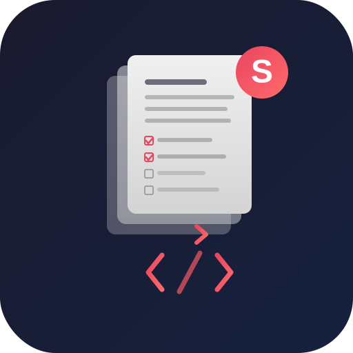

<p align="center">
  
</p>

<h3 align="center">Make your AI agent think before it codes.</h3>

<p align="center">
  <a href="https://github.com/sanmak/specops/actions/workflows/ci.yml"></a>
  <a href="https://github.com/sanmak/specops/releases"></a>
  <a href="https://github.com/sanmak/specops"></a>
  <a href="https://github.com/sanmak/specops/blob/main/LICENSE"></a>
</p>

---

You describe a feature to your AI coding assistant. It starts writing code immediately. No requirements. No design. No task breakdown. You spend the next hour correcting assumptions it made in the first minute.

The problem isn't the AI. It's that nobody told it to think first.

## What SpecOps Does

SpecOps adds a structured thinking step to AI coding. One command triggers a 4-phase workflow:

1. **Understand** the codebase and context
2. **Spec** requirements, design, and ordered tasks
3. **Implement** from the spec, not from assumptions
4. **Complete** with verified acceptance criteria

Specs are git-tracked, survive across sessions, and work natively with **Claude Code**, **Cursor**, **OpenAI Codex**, and **GitHub Copilot**.

## Quick Start

**Claude Code (plugin marketplace):**

```text
/plugin marketplace add sanmak/specops
/plugin install specops@specops-marketplace
/reload-plugins
```

**One-line install (any platform):**

```bash
bash <(curl -fsSL https://raw.githubusercontent.com/sanmak/specops/main/scripts/remote-install.sh)
```

**Or clone and run:**

```bash
git clone https://github.com/sanmak/specops.git && cd specops && bash setup.sh
```

**Try it:**

```text
/specops Add user authentication with OAuth
```

> Platform-specific install details: [QUICKSTART.md](QUICKSTART.md) | Full command reference: [docs/COMMANDS.md](docs/COMMANDS.md)

## Before and After

**Without SpecOps:**

```text
You: "Add OAuth authentication"
Agent: *writes auth.ts, picks JWT without asking, hardcodes Google,
       skips rate limiting, creates 6 files*
You: "No, I needed GitHub too, and..." (30 min of corrections)
```

**With SpecOps:**

```text
You: "/specops Add OAuth authentication"
Agent:
  requirements.md  ->  4 user stories, 12 acceptance criteria (EARS notation)
  design.md        ->  JWT vs sessions trade-off, provider abstraction layer
  tasks.md         ->  8 ordered tasks with dependencies and effort estimates
  Then implements each task against verified criteria.
```

<p align="center">
  
</p>

## Problems SpecOps Solves

| Problem | How SpecOps handles it |
| --- | --- |
| AI starts coding without understanding the domain | 7 vertical templates: backend, frontend, infra, data pipelines, library/SDK, fullstack, builder |
| Specs lost when you close the session | Git-tracked spec files with cross-session context recovery |
| Agent forgets decisions from yesterday | Local memory layer, loaded automatically every session |
| No way to review specs before coding starts | Built-in team review workflow with configurable approval gates |
| Agent hallucinates vague acceptance criteria | EARS notation for precise requirements: `WHEN [event] THE SYSTEM SHALL [behavior]` |
| Specs drift from codebase after implementation | 5 automated drift checks with audit and reconcile commands |
| Locked into one AI coding tool | One source of truth, 4 platform outputs |

## Built With SpecOps

Every feature of SpecOps was specified, designed, and implemented using the SpecOps workflow. All specs are [public in `.specops/`](.specops/). The [friction log](internal/dogfood-friction.md) captures 42 lessons learned that shaped the tool.

## What Only SpecOps Does

- **Multi-platform**: the only spec-driven development tool that works across Claude Code, Cursor, OpenAI Codex, and GitHub Copilot from a single source
- **Vertical awareness**: domain-specific spec templates. Infrastructure specs include rollback steps and resource definitions. Data pipeline specs include data contracts and backfill strategy.
- **Enforcement, not suggestions**: CI-integrated drift detection, checkbox completion gates, and approval workflows that block implementation until specs are approved
- **Open source, local, no lock-in**: everything is git-tracked markdown. No cloud service, no account required. MIT license.

> [Full comparison with Kiro, EPIC/Reload, and Spec Kit](docs/COMPARISON.md) | [Plan Mode vs Spec Mode](docs/PLAN-VS-SPEC.md)

## Platforms

| Platform | Trigger |
| --- | --- |
| **Claude Code** | `/specops [description]` |
| **Cursor** | `Use specops to [description]` |
| **OpenAI Codex** | `Use specops to [description]` |
| **GitHub Copilot** | `Use specops to [description]` |

## Configuration

Create `.specops.json` in your project root. Configuration is optional. SpecOps uses sensible defaults.

```json
{
  "specsDir": ".specops",
  "vertical": "backend",
  "team": {
    "conventions": ["Use TypeScript", "Write tests for business logic"],
    "reviewRequired": true
  }
}
```

> Examples: [examples/](examples/) | Full schema reference: [REFERENCE.md](docs/REFERENCE.md) | Steering files: [STEERING_GUIDE.md](docs/STEERING_GUIDE.md)

## Writing Philosophy

Specs generated by SpecOps follow principles from Rich Sutton (importance ordering), George Orwell (cut unnecessary words), Jeff Bezos (narrative over bullet points), Leslie Lamport (precision over completeness), and Steven Pinker (concrete over abstract). Every requirement passes the ANT test (Arguably Not True): if a statement cannot be false, it carries no information and gets rewritten. [Full rules](core/writing-quality.md).

## Contributing

Contributions welcome. See [CONTRIBUTING.md](CONTRIBUTING.md) for guidelines.

## License

[MIT](LICENSE)
