# SpecOps Sequence Diagrams

Interactive sequence diagrams showing actor interactions across SpecOps workflows. These complement the high-level SVG diagrams in [`assets/`](../assets/) with detailed message-passing views.

> **Rendering:** GitHub renders these Mermaid diagrams natively. In VS Code, use the [Markdown Preview Mermaid Support](https://marketplace.visualstudio.com/items?itemName=bierner.markdown-mermaid) extension.

---

## Overall 4-Phase Workflow

The core SpecOps workflow: understand context, generate a spec, implement tasks, and verify completion.

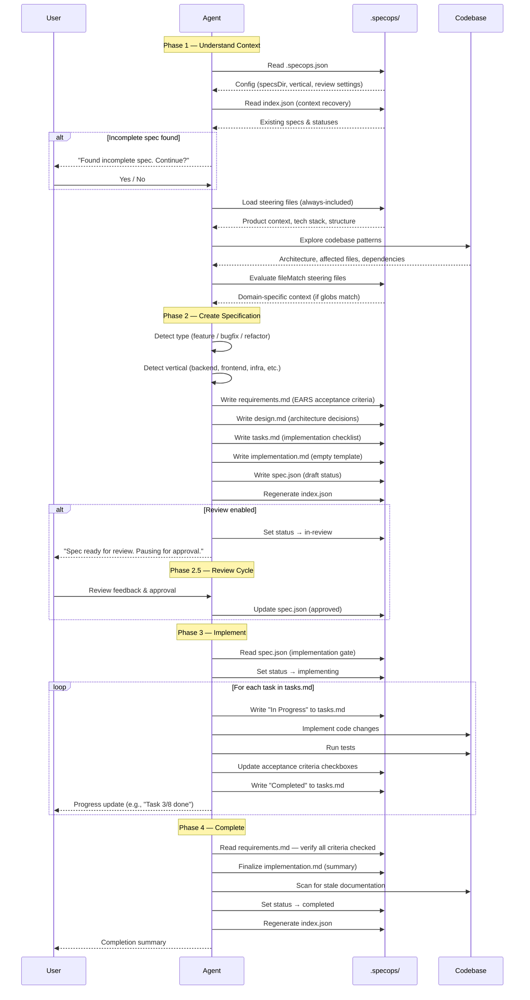

**Source:** [`core/workflow.md`](../core/workflow.md)

---

## Interview Mode

Structured Q&A for vague or high-level ideas. Transforms "I want to build a SaaS" into a spec-ready problem statement.

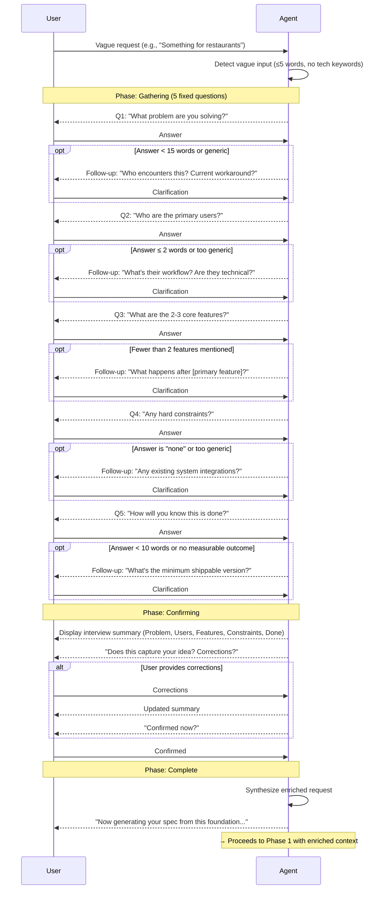

**Source:** [`core/interview.md`](../core/interview.md)

---

## Collaborative Review

Team-based spec review cycle between spec creation (Phase 2) and implementation (Phase 3).

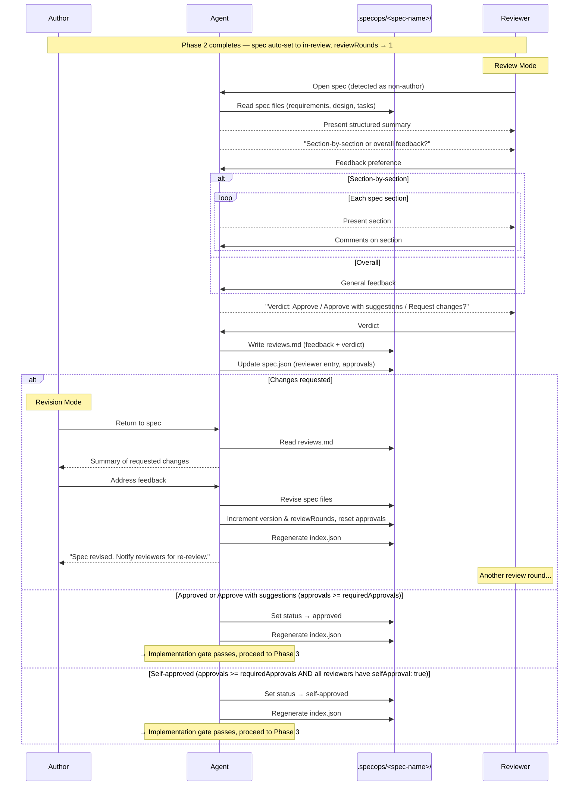

**Source:** [`core/review-workflow.md`](../core/review-workflow.md)

---

## From-Plan Conversion

Converts an existing AI plan into a persistent SpecOps spec. Faithful mapping — no re-derivation.

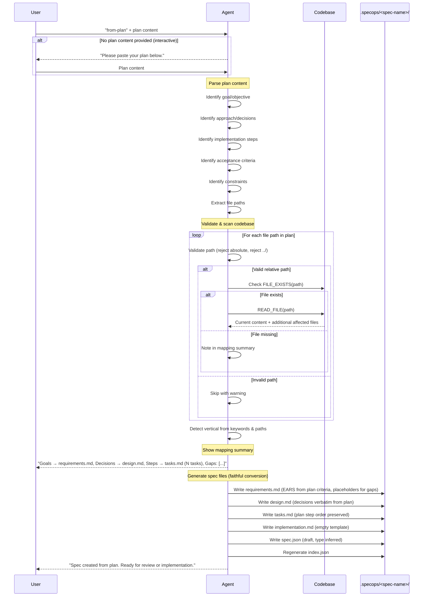

**Source:** [`core/from-plan.md`](../core/from-plan.md)

---

## Task Execution (Phase 3)

Write-ordering protocol and task state machine during implementation.

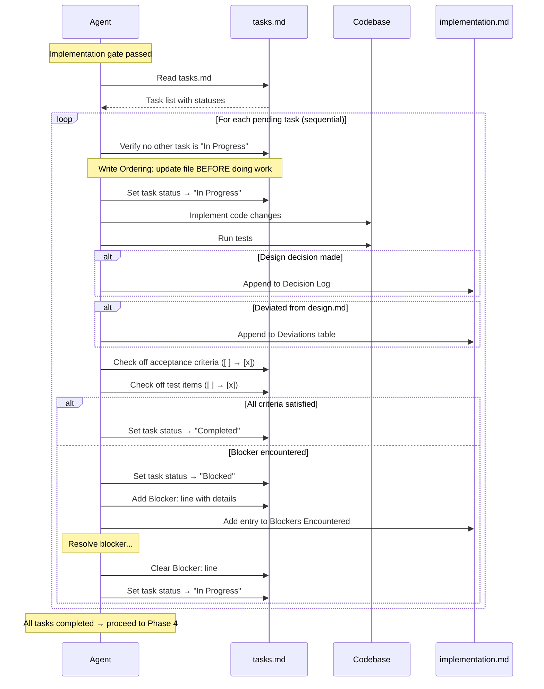

**Valid state transitions:**

```text
Pending ──────► In Progress
In Progress ──► Completed
In Progress ──► Blocked
Blocked ──────► In Progress
```

**Source:** [`core/task-tracking.md`](../core/task-tracking.md)

---

## Audit & Reconcile

Drift detection between spec artifacts and the live codebase, with interactive repair.

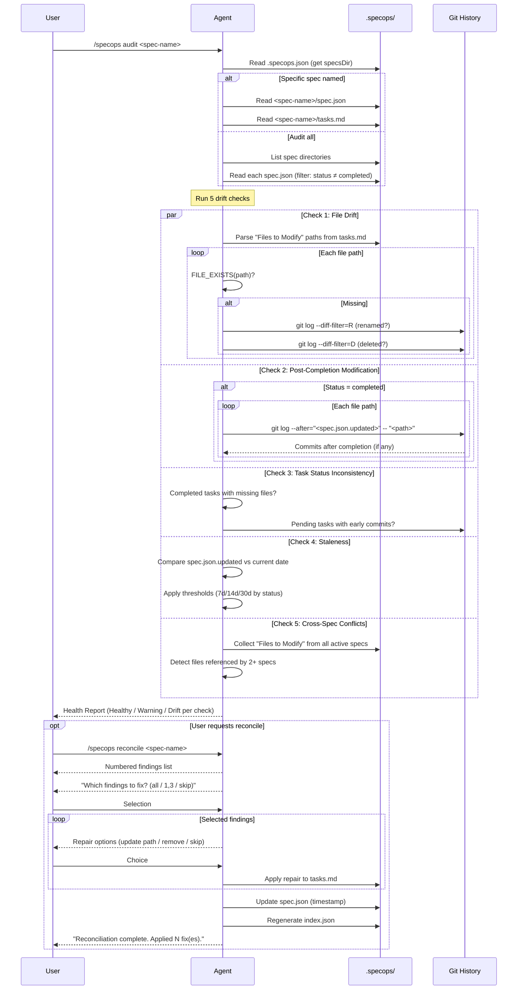

**Source:** [`core/reconciliation.md`](../core/reconciliation.md)

---

## Steering File Loading

How persistent project context is loaded during Phase 1.

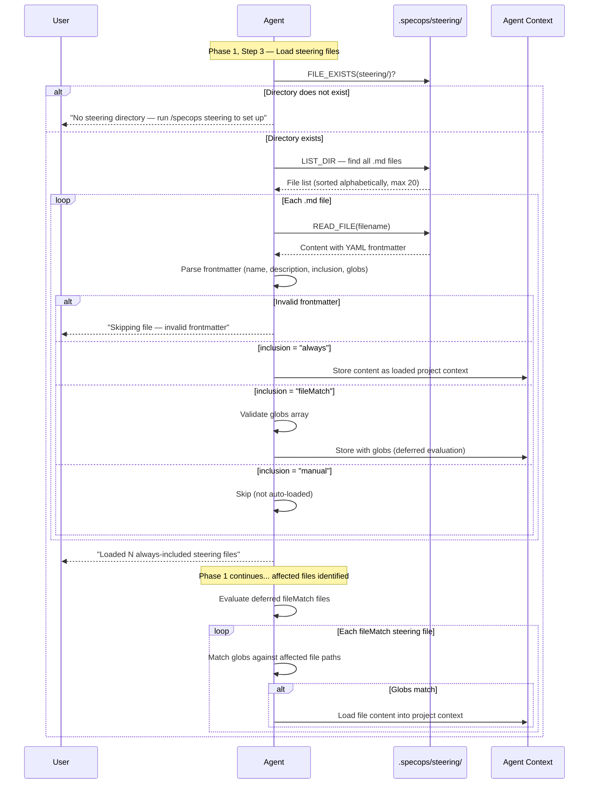

**Source:** [`core/steering.md`](../core/steering.md)

---

## Init

Initialize SpecOps configuration in a project.

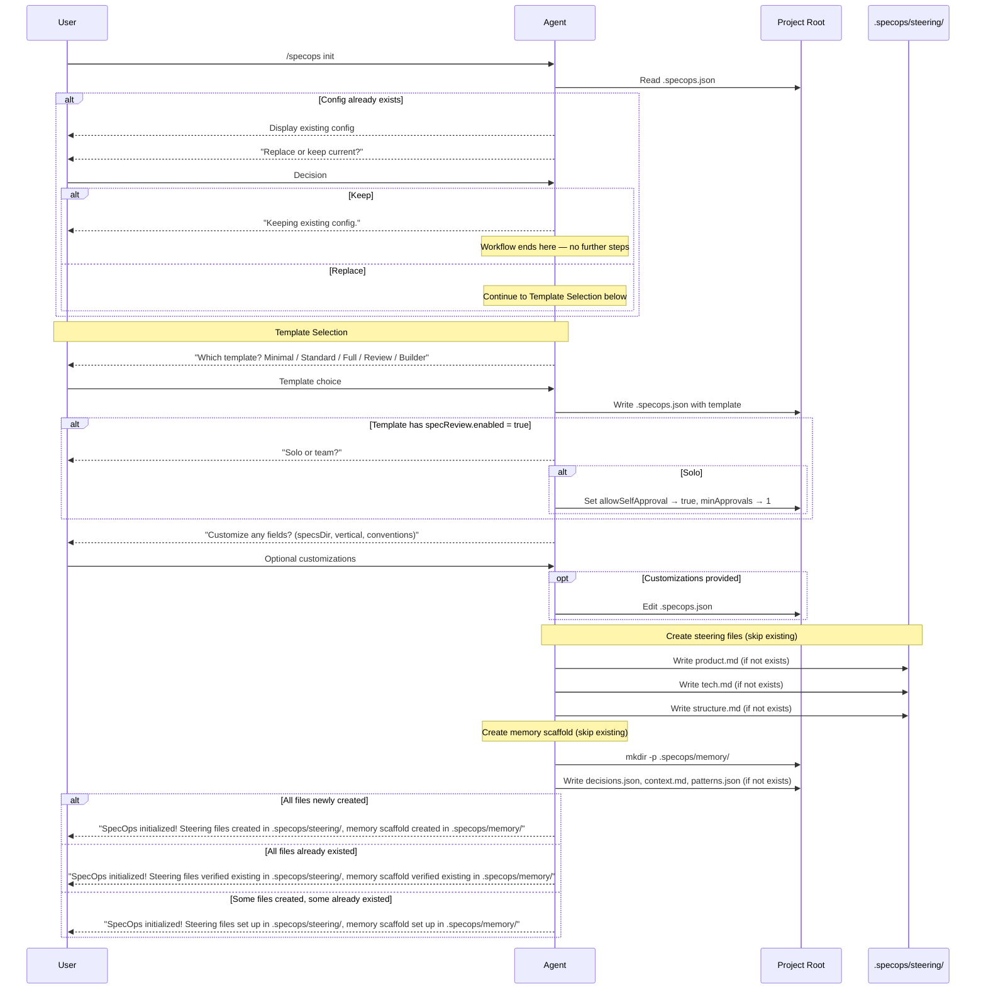

**Source:** [`core/init.md`](../core/init.md)

---

## Spec Decomposition Workflow

Automatic scope assessment, split detection, and initiative orchestration for large features.

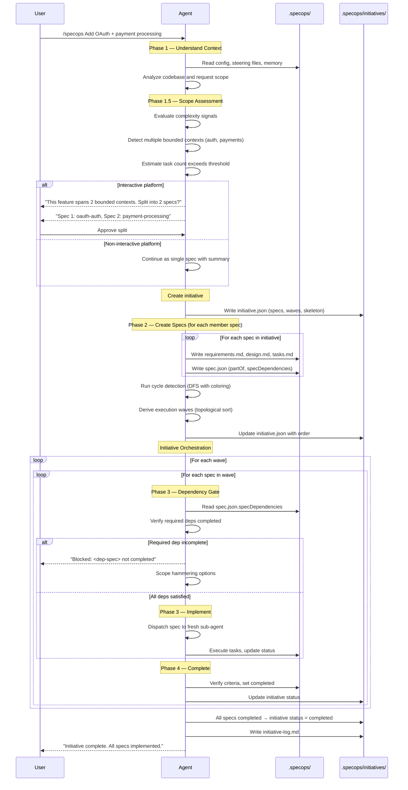

**Source:** [`core/decomposition.md`](../core/decomposition.md), [`core/initiative-orchestration.md`](../core/initiative-orchestration.md)

---

## Adversarial Evaluation

Two-touchpoint quality scoring: spec evaluation at Phase 2 exit and implementation evaluation at Phase 4A.

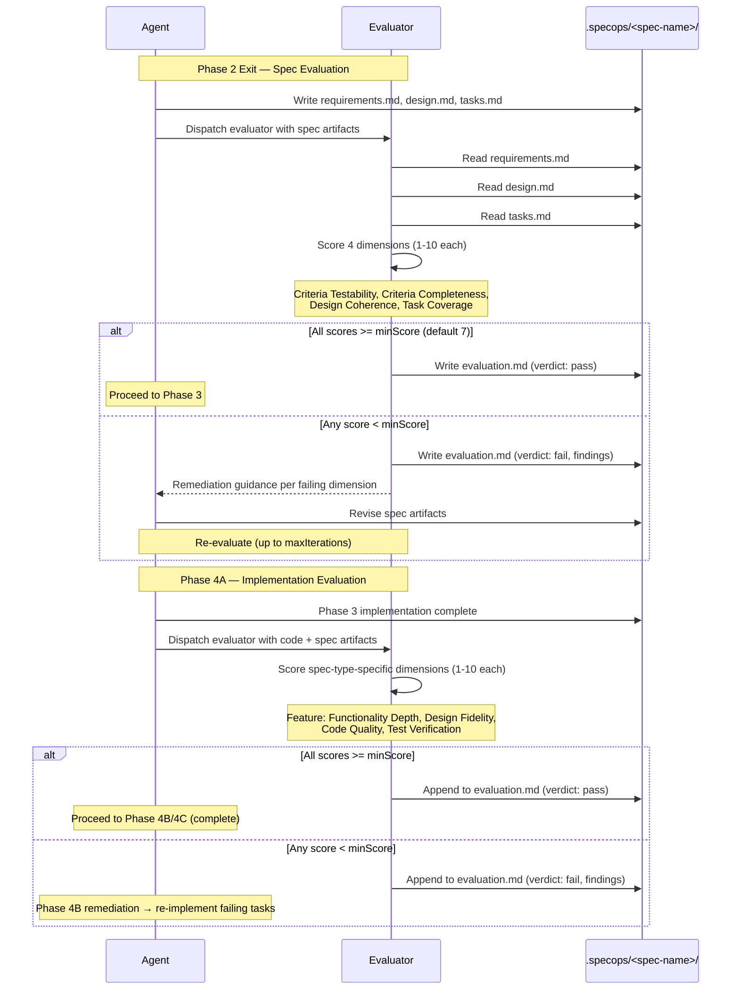

**Source:** [`core/evaluation.md`](../core/evaluation.md)

---

## Production Learnings Lifecycle

Capture, store, and surface post-deployment discoveries across spec sessions.

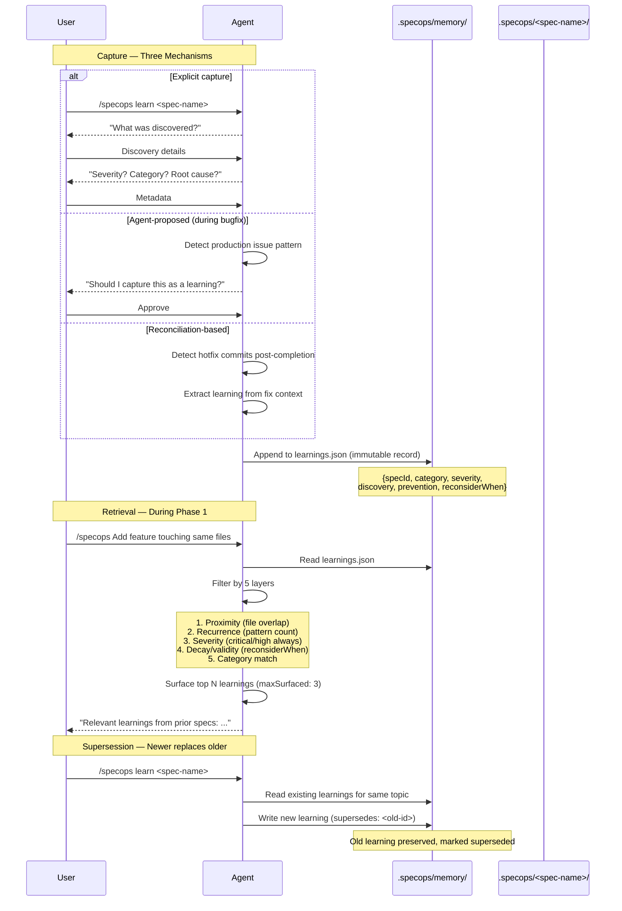

**Source:** [`core/learnings.md`](../core/learnings.md)
